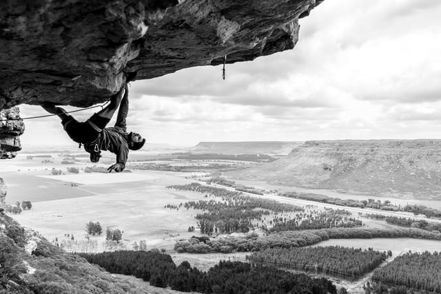
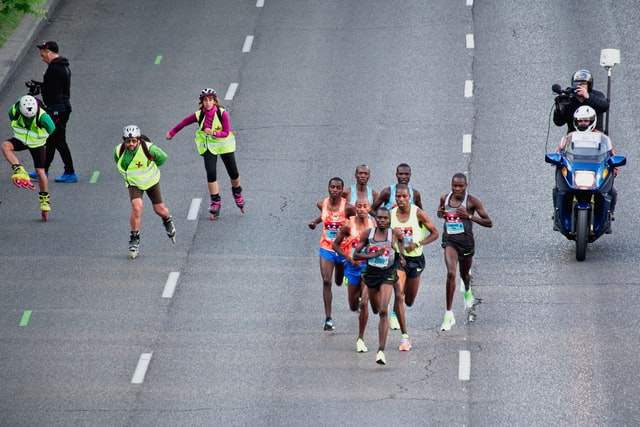

#### Programming is a learning marathon 🎽

If you consider the total amount of continuous learning that a dedicated programmer does over the course of many years - then it is more analogous to an ultra marathon of the most brutal kind.

It is rewarding with small victories scattered throughout.

It is even quite often fun.

But it is not easy at all and it is often uncomfortable.

#### Growing as a programmer - an extreme sport 🏂🏼

For as long as I can remember I have been fascinated by extreme sport athletes.

People like
Tour de France cyclists, big wave surfers, extreme skiers, free solo rock climbers, or
mountaineers summiting K2 are very interesting humans.

How, I have often wondered, do they keep their composure during
activities that would overwhelm and overload most people? What is the mindset? And does that mindset
simply exist from the beginning for the individual or is it developed over time?

Photo by <a href="https://unsplash.com/@jeffochoa?utm_source=unsplash&utm_medium=referral&utm_content=creditCopyText">Jeff Ochoa</a> on <a href="https://unsplash.com/s/photos/rock-climbing?utm_source=unsplash&utm_medium=referral&utm_content=creditCopyText">Unsplash</a>

There is no imaginable way that any of those things could be ["comfortable"](https://www.merriam-webster.com/dictionary/comfortable) in the traditional sense
of the word. But is it possible to become comfortable with the discomfort? Maybe even settle into it
and find peace and satisfaction in the middle of it?

These activities probably often elicit a [flow state](<https://en.wikipedia.org/wiki/Flow_(psychology)>) - which brings joy and elation and a feeling of victory. And programming can do this too.

Over time, I imagine the practitioners of anything extreme have learned to become comfortable with the pain, exhaustion, fear, heat, cold, or altitude. Perhaps they make peace with discomfort and then simply go about their business - knowing that there are rewards to their actions - even while the discomfort exists.

#### Not exactly pain - but close 😕

Feeling at the very edge of your knowledge is not comfortable.

It can make you feel inadequate and amateurish and can even make you feel that you are not cut out for the task you are engaged in.

When I have to search for answers on Google and StackOverflow, read carefully through documentation, figure out error message
after error message, or remember a piece of information that I have either applied before or come across before but can
not recall in the moment - it can make me feel like I am a dumb person. Not fit for the task I
am engaged in.

And considering the vastness of computer science and programming in general - who is not operating on the edge of their knowledge if they are serious about building things with code?

Sure, I know more and I can do more than I did last month or even yesterday. And I know A GREAT DEAL MORE
than I did last year, but the amount of things I do not know far, far outweighs the things that I do know.

A lesson I have learned for myself, over nearly four years since I wrote my first line of code - is
that I need to be **comfortable with feeling dumb**.

I do not see myself most times as a dumb person. But I **feel like I am** - often.

Programming makes me feel that way. Writing code is hard. Confusing. Often unclear. Always at the edge of things unknown and unlearned.

One thing I have learned is that I need to **settle into that**. Like an ultra marathon runner settles into pain.

One of my friends ran cross country track in highschool. I remember him telling me that he was
always a little scared before a race. He trained running long distances a lot and I asked him why he
had felt fear. Was it the fear of losing? I asked him. He said:

> "No, it was because I knew I was going to feel pain."

I asked him if it got easier through the season as he trained more, got stronger, built his cardio.

> "It doesn't get easier. You just run that much harder. So you're always going to feel pain."

Photo by <a href="https://unsplash.com/@amutiomi?utm_source=unsplash&utm_medium=referral&utm_content=creditCopyText">Miguel A. Amutio</a> on <a href="https://unsplash.com/s/photos/marathon?utm_source=unsplash&utm_medium=referral&utm_content=creditCopyText">Unsplash</a>

#### I have seen the same thing with parenting 🤹‍♂️

When my kids were babies I thought parenting
might get easier when my kids could eat without being spoon fed, or when they could walk and did not
need to be carried everywhere, or when they could put themselves in their own car seats, or when
they could talk and discuss their feelings with me.

But it never gets any easier. There are just new
horizons to walk toward, new things that come up with raising them, no finish line in sight. Ever.

The same is true of programming. No matter which language or framework or piece of the vastness that
I am currently working in.

So, I decided to simply settle in and make friends with being on the edge of my knowledge always.

For example, whenever a part of React or Python or Node becomes clear to me and I feel confident
with a certain aspect of the work - yes, I feel the satisfaction for a few moments. I know I have gained something that I can use again. Then what happens?

> ". . . run that much harder."

The satisfaction is fleeting 😥

In other words, I end up tackling more complex problems, heretofore unknown, and I am back to
feeling dumb again.

There is nothing else to do but deal with that feeling head on and make peace with it. Because it
will always be there.

The trick I have found for myself is breathe easy, maybe stretch or move in some way, and **just be
okay with it**.

That is programming and I am at home there.

It is the only way to move forward.

And moving forward is the biggest victory when hitting a wall 🥇
